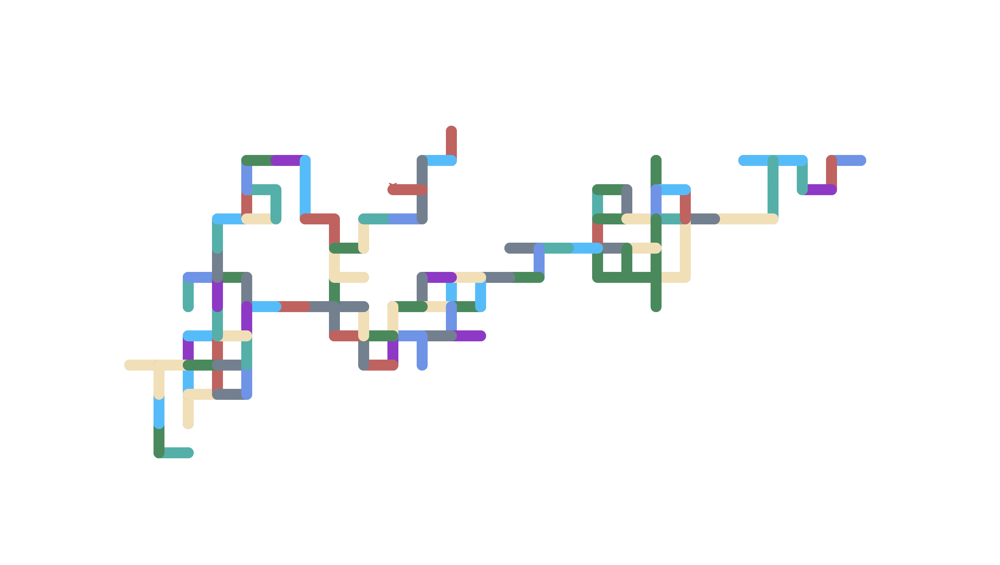

# 🐢 Python Turtle Random Walk

A colorful random-walk visualization built using **Python Turtle**.

The turtle moves in random directions using only **0°, 90°, 180°, and 270°**, creating a squared/maze-like pattern. Each movement is assigned a randomly selected color.

## 🎨 Output

## 🛠️ Concepts Used

* Python `turtle` module
* Random color selection
* Random direction selection
* `for` loops
* Lists
* Functions such as `choice()`
* Turtle pen size and movement

## 🚀 How It Works

1. A turtle is created with a pen size of `15`.
2. A random color is selected from the `colours` list.
3. The turtle moves forward by `30` pixels.
4. A random direction is selected from:

   * `0°`
   * `90°`
   * `180°`
   * `270°`
5. The process repeats **100 times**.

